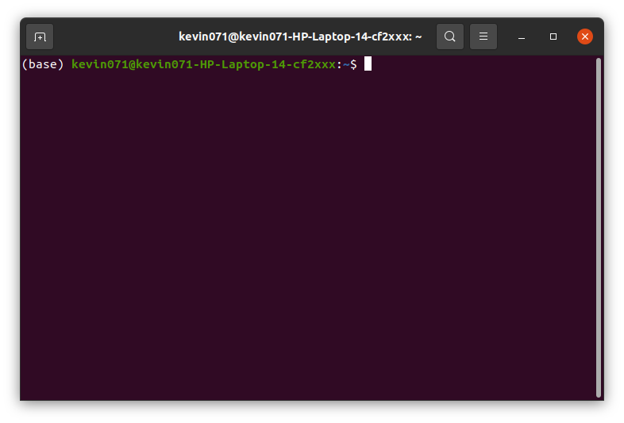

# Activar y desactivar base atras del comando de terminal 

Por lo general cuando se instala Anaconda, aparece en nuestra terminal algo parecido despues de instalarla:

 

 

Entonces para quitar esa palabra **(base)** se ejecutan los siguientes pasos:

 

## 1. Se comprueba si "*auto_activate_base*" esta como activado

 

Esto se puede lograr con el siguiente comando:

 

    conda config --show | grep auto_activate_base

 

Este comando dirá True o False dependiendo si está activado o no.

 

## 2. Desactivar ese comando

 

Para hacer esto se ejecuta el siguiente comando:

 

    conda config --set auto_activate_base False

Ya con esto se quitará esta palabra de la terminal.

 

## 3. Activar ese comando

 

Sin este comando no se podrá iniciar el ambiente conda y por lo tanto no podrás ejecutar comandos de **Anaconda**. Para activarlo se ejecuta el siguiente comando:

 

    conda config --set auto_activate_base True

 

Para ver si funciona realmente este comando ejecuten el siguiente comando con el auto_activate_base en True y en False:

 

    jupyter notebook

