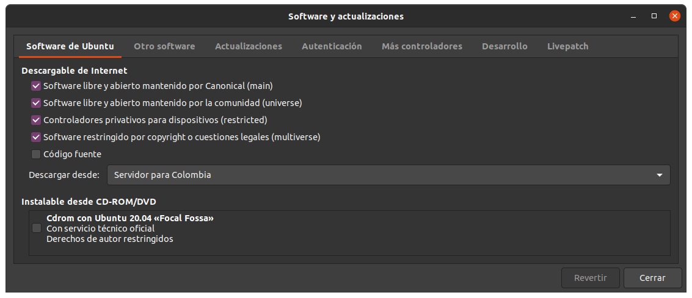
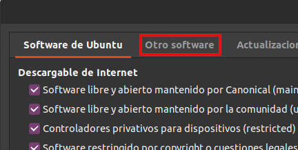
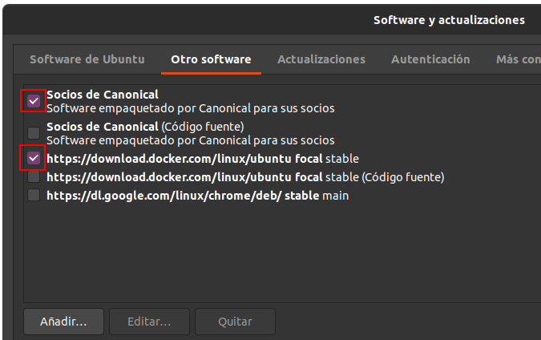
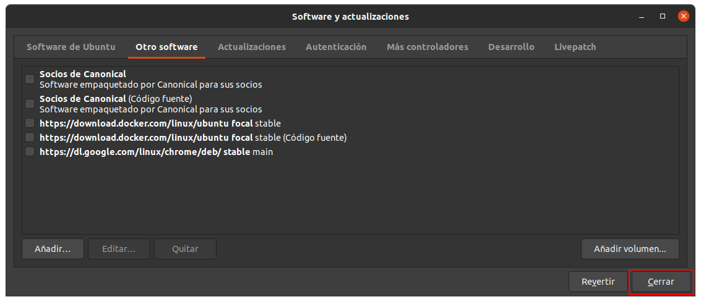
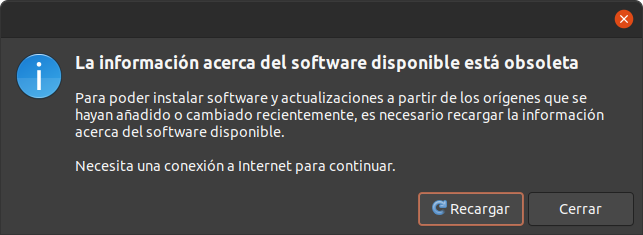
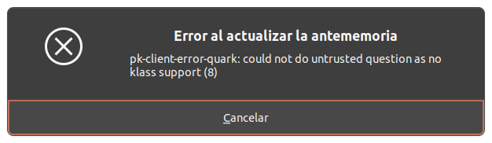
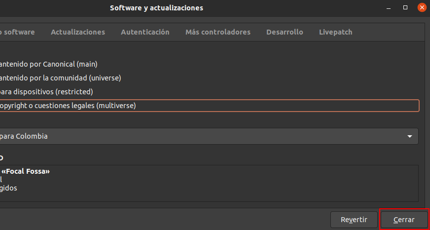

# Comando "apt-get update" ó "apt update"

Este comando usualmente sirve para mostrar las actualizaciones que se deben hacer en el sistema, pero aveces muestra que hay varios paquetes que están configurados varias veces.  

## 1. Abrir software y actualizaciones

Para abrir esta app, ejecutamos el siguiente comando:

    sudo software-properties-gtk

  Ahora se nos abrirá la ventana de software y aplicaciones:

  

## 2. Usando la aplicación

1. Nos dirigimos a la seccion de **Otro software**:

      

2. Desmarcamos las casillas que esten seleccionadas:

      

3. Presionamos el boton cerrar:

      

4. Ahora presionamos en el botón recargar:

      

Listo, ya con esto terminariamos el proceso. La ventana de actualizaciones debería cerrarse.

## 3. En caso de errores:

 En caso de que nos salga este error cuando usemos el botón recargar:

  

- Ejecutamos el siguiente comando:

        sudo rm /etc/apt/sources.list

- Si nos arroja un error es porque ese archivo ya no existe. Ahora ejecutamos el siguiente comando:

        sudo rm /etc/apt/sources.list.d/* -vf

- Ya con esto procedemos a repetir el comando:

        sudo software-properties-gtk

- Seleccionamos las primeras 4 casillas de ubuntu-software:

      

- Presionamos el botón cerrar:

      

- Por último presionamos el botón revertir y cuando termine de ejecutarse, ejecutamos en la terminal:

        sudo apt-get update

Ya veremos que no está mas ese error.
